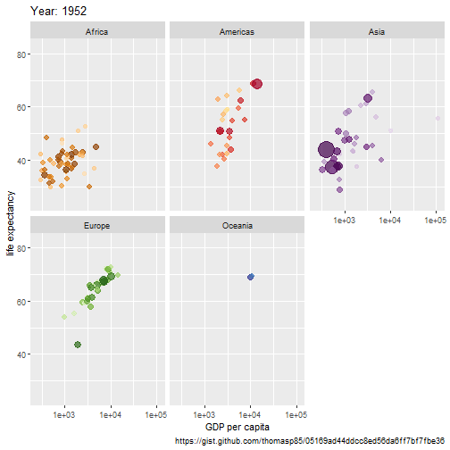
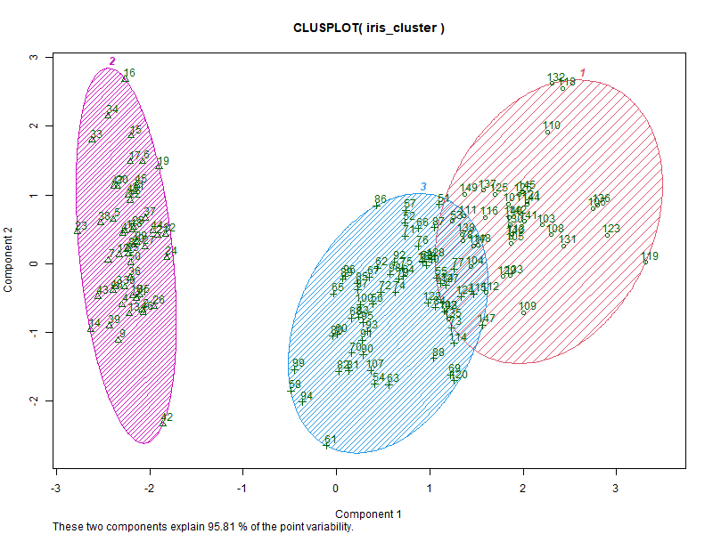
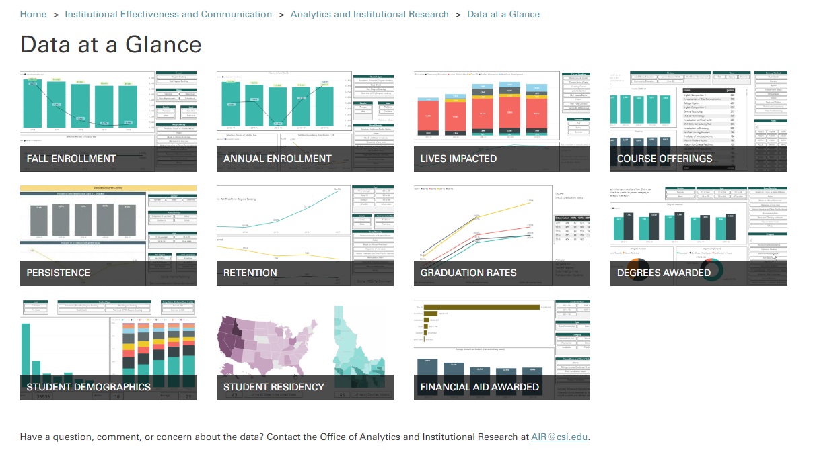

# So Many Project Ideas, Not Enough Time!

--

.pull-left[

Fancy Visualizations (gganimate)

]

--

.pull-right[

Fancy Machine Learning (lots of R packages):

]

--

<b> It can be quite hard to find the time to explore and enhance </b>

---

# Objective

## Scope

- Demonstrate a few examples of leveraging a tool like R to speed up processes.

--

- Highlight key R packages and brief overview of the code flow.

--

- Spur curiosity and ideas.

--

- If you think, "Hey, I can do that better, or I might tweak that a bit." That's Great!

--

## Overview

- Visualization (Internal Organization)
- Text File Creation (IPEDS Completions)
- Excel File Creation (State Reporting or Ad Hoc Needs)
- Bulk Reporting (Program Review)
- Additional Examples (Reproducible Research and Analytics)
- Discussion and Q&A

---

# College of Southern Idaho (CSI)

## Analytics and Institutional Research (AIR) Team

- FTE: 2.5 to 3.0
- Scope: Decision support, business intelligence, data-related compliance. Teamwork with IT on data governance.

## Implemented Software

- Jenzabar EX ERP / SIS
- Microsoft SQL Server
- No Enterprise Data Warehouse
- Power BI

---

# Idaho State Univeristy (ISU)

## Institutional Research (IR) Team

- FTE: 3.0 (soon to be 4.0!)
- Scope: Decision support, business intelligence, data-related compliance, production reporting. Teamwork with IT on data governance.

## Implemented Software

- Ellucian Banner
- Oracle SQL
- Data Warehouse (Brand New)
- Tableau (Just Getting Started)

--

<b> These solutions should be agnostic to the software used at most institutions </b>

---

# Live Coding Session

- Visualization (Internal Organization)

--

- Text File Creation (IPEDS Completions)

--

- Excel File Creation (State Reporting or Ad Hoc Needs)

--

- Bulk Reporting (Program Review)

--

- Additional Examples (Reproducible Research and Analytics)

---

# Limitations

- Reporting requirement changes.
- Business process changes.
- Software changes.

---

# Outcomes

This work has allowed for... (team effort big time!!!)

- Implementation of fairly wide-spread business intelligence usage

--

- Promptly keeping up with new requirements (e.g. NWCCU disaggregation) 

--

- Predictive analytics and implementation with stakeholders. 

--

- Beginning of data literacy training.

--

- Improving institution-wide data documentation.

---

# Conclusion

<b>https://github.com/ThomasSharpeISU/AIHEC_IR24</b>

---

# Discussion and Q&A

