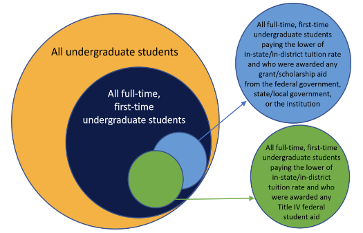
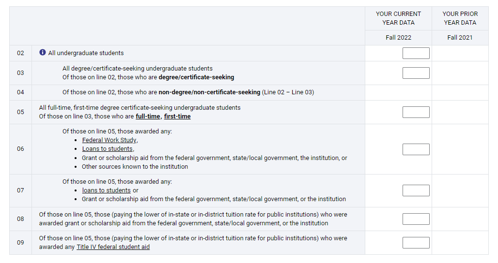
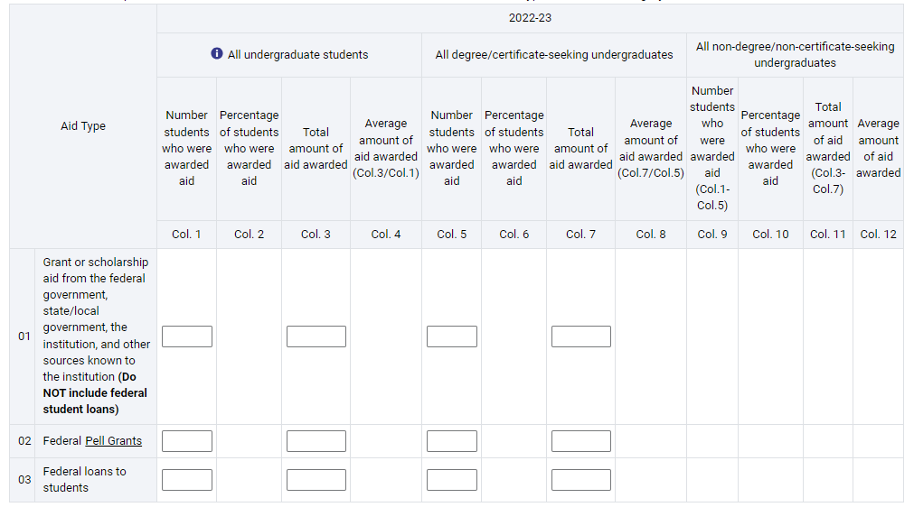
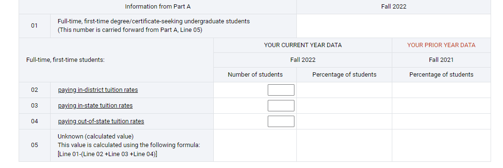
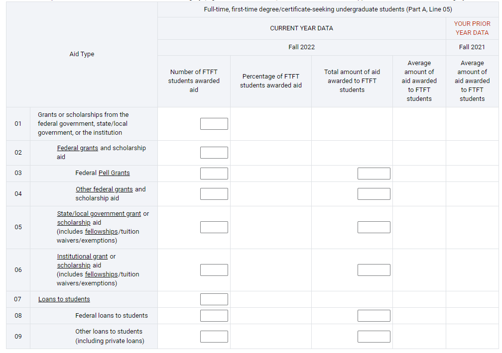
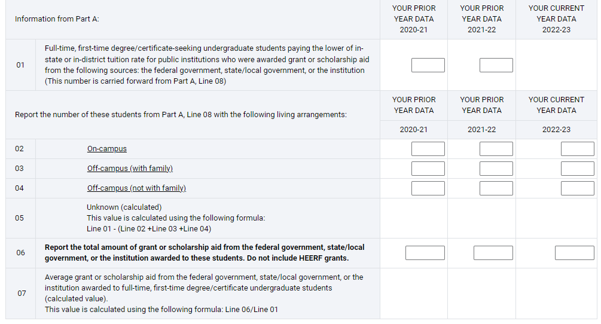
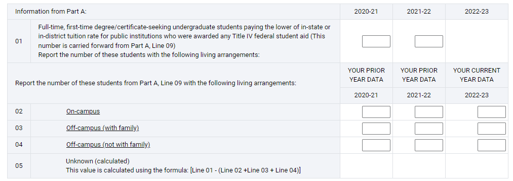
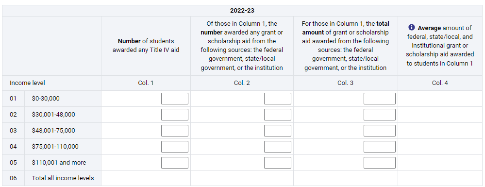

```{r setup, include=FALSE}
knitr::opts_chunk$set(echo = FALSE, message = FALSE, warning = FALSE, fig.width = 8, fig.height =6)
knitr::opts_knit$set(root.dir = 'C:\\Users\\Thomas Sharpe\\Desktop\\AIHEC_IR24\\IntroR\\FinAid')
```

## Scenario

You need to complete the IPEDS Financial Aid Survey. You receive financial aid related data from the Financial Aid Office, enrollment data from the registrar and cohort data from your own system. We will need to combine these data to finish the task.

For today, we will build it with manually entering the data into the IPEDS system in mind. Tomorrow, we will demonstrated how to upgrade the process to automatically loading data via a text file.

## Overall Survey



## Prep Environment

```{r}

library(dplyr)
library(ggplot2)
library(scales)
library(readxl)
library(reshape2)
library(DT)

dCohorts <- read_excel('Cohorts.xlsx', sheet = 'Cohorts')
dEnroll <- read_excel('FallEnrollment.xlsx')
dAid <- read_excel('FinAid.xlsx', sheet = 'Aid')
dFAFSA <- read_excel('FinAid.xlsx', sheet = 'Students')


```


## Prep Data

```{r}

dAidSummary <- 
  dAid %>%
  group_by(STUDENT_ID) %>%
  summarise(anyAid = sum(AWARD_AMT),
            loanOrNoWorkStudy = sum(AWARD_AMT[FUND_TYPE == 'L' | (FUND_TYPE == 'G' & FUND_ENTITY != 'Private')]),
            grantNoPrivate = sum(AWARD_AMT[FUND_TYPE == 'G' & FUND_ENTITY != 'Private']),
            fedNoWorkStudy = sum(AWARD_AMT[FUND_ENTITY == 'Federal' & FUND_TYPE != 'W']))
  

dGroups <- left_join(dEnroll,dCohorts, by = 'STUDENT_ID')
dGroups <- left_join(dGroups, dAidSummary, by = 'STUDENT_ID')

dGroups$anyAid <- ifelse(is.na(dGroups$anyAid) == TRUE, 0,dGroups$anyAid)
dGroups$loanOrNoWorkStudy <- ifelse(is.na(dGroups$loanOrNoWorkStudy) == TRUE, 0,dGroups$loanOrNoWorkStudy)
dGroups$grantNoPrivate <- ifelse(is.na(dGroups$grantNoPrivate) == TRUE, 0,dGroups$grantNoPrivate)
dGroups$fedNoWorkStudy <- ifelse(is.na(dGroups$fedNoWorkStudy) == TRUE, 0,dGroups$fedNoWorkStudy)

dGroups <- 
  dGroups %>%
  mutate(GROUP1 = 'Y',
         GROUP1_DS = ifelse(MAJOR_CODE == 'NOND','N','Y')) %>%
  mutate(GROUP2 = ifelse(is.na(FIRST_TERM) == FALSE & CREDIT_HOURS >= 12 & GROUP1_DS == 'Y','Y','N')) %>%
  mutate(GROUP2A = ifelse(GROUP2 == 'Y' & anyAid > 0,'Y','N'),
         GROUP2B = ifelse(GROUP2 == 'Y' & loanOrNoWorkStudy > 0,'Y','N'),
         GROUP3 = ifelse(GROUP2 == 'Y' & grantNoPrivate > 0,'Y','N'),
         GROUP4 = ifelse(GROUP2 == 'Y' & fedNoWorkStudy > 0,'Y','N'))


```

```{r}

dAidGroups <- left_join(dAid, dGroups, by = 'STUDENT_ID')

dAidGroups <- left_join(dAidGroups, dFAFSA, by = 'STUDENT_ID')

dAidGroups <-
  dAidGroups %>%
  select(STUDENT_ID, FUND_CODE, FUND_TYPE, FUND_ENTITY, AWARD_AMT, TUITION, LIVING,INCOME, GROUP1, GROUP1_DS, GROUP2, GROUP2A, GROUP2B, GROUP3, GROUP4)

```

## Report

### Section 1 Part A



```{r}

temp <- melt(dGroups,id.vars = 'STUDENT_ID',measure.vars = c('GROUP1','GROUP1_DS','GROUP2','GROUP2A','GROUP2B','GROUP3','GROUP4'))

colnames(temp) <- c('STUDENT_ID','GROUP','VALUE')

Sec1PartA <- 
  temp %>%
  group_by(GROUP) %>%
  summarise(students = n_distinct(STUDENT_ID[VALUE == 'Y']))

rm(temp)

datatable(Sec1PartA, rownames = FALSE)


```

*Rearrange things so all of the descriptors (e.g. Groups, Tuition rates, income are pushed to the Aid table and then distinct counts and sums.)

### Section 1 Part B




```{r}

temp1 <-
  dAidGroups %>%
  filter(FUND_TYPE == 'G') %>%
  summarise(students = n_distinct(STUDENT_ID),
            awardTotal = sum(AWARD_AMT),
            dsStudents = n_distinct(STUDENT_ID[GROUP1_DS == 'Y']),
            dsAwardTotal = sum(AWARD_AMT[GROUP1_DS == 'Y']))

temp2 <-
  dAidGroups %>%
  filter(FUND_CODE == 'FED_PELL') %>%
  summarise(students = n_distinct(STUDENT_ID),
            awardTotal = sum(AWARD_AMT),
            dsStudents = n_distinct(STUDENT_ID[GROUP1_DS == 'Y']),
            dsAwardTotal = sum(AWARD_AMT[GROUP1_DS == 'Y']))

temp3 <-
  dAidGroups %>%
  filter(FUND_TYPE == 'L' & FUND_ENTITY == 'Federal') %>%
  summarise(students = n_distinct(STUDENT_ID),
            awardTotal = sum(AWARD_AMT),
            dsStudents = n_distinct(STUDENT_ID[GROUP1_DS == 'Y']),
            dsAwardTotal = sum(AWARD_AMT[GROUP1_DS == 'Y']))

Sec1PartB <- rbind(temp1, temp2,temp3)

rm(temp1,temp2,temp3)

datatable(Sec1PartB, rownames = FALSE)


```


### Section 1 Part C Page 1



```{r}

Sec1PartCPage1 <-
  dAidGroups %>%
  filter(GROUP2 == 'Y') %>%
  group_by(TUITION) %>%
  summarise(students = n_distinct(STUDENT_ID))

datatable(Sec1PartCPage1, rownames = FALSE)


```


### Section 1 Part C Page 2



```{r}

dGroup2 <-
  dAidGroups %>%
  filter(GROUP2 == 'Y')

temp1 <-
  dGroup2 %>%
  summarise(Description = 'Grant Aid', Students = n_distinct(STUDENT_ID), Amount = NA)

temp2 <-
  dGroup2 %>%
  filter(FUND_ENTITY == 'Federal' & FUND_TYPE == 'G') %>%
  summarise(Description = 'Fed Grant Aid', Students = n_distinct(STUDENT_ID), Amount = sum(AWARD_AMT))

temp3 <-
  dGroup2 %>%
  filter(FUND_CODE == 'FED_PELL') %>%
  summarise(Description = 'Fed Pell', Students = n_distinct(STUDENT_ID), Amount = sum(AWARD_AMT))


temp4 <-
  dGroup2 %>%
  filter(FUND_ENTITY == 'Federal' & FUND_TYPE == 'G' & FUND_CODE != 'FED_PELL') %>%
  summarise(Description = 'Fed Grant, not pell', Students = n_distinct(STUDENT_ID), Amount = sum(AWARD_AMT))

temp5 <-
  dGroup2 %>%
  filter(FUND_ENTITY %in% c('State','Local') & FUND_TYPE == 'G') %>%
  summarise(Description = 'State or Local Government Grants', Students = n_distinct(STUDENT_ID), Amount = sum(AWARD_AMT))


temp6 <-
  dGroup2 %>%
  filter(FUND_ENTITY == 'Institution' & FUND_TYPE == 'G') %>%
  summarise(Description = 'Institution Grants', Students = n_distinct(STUDENT_ID), Amount = sum(AWARD_AMT))

temp7 <-
  dGroup2 %>%
  filter(FUND_TYPE == 'L') %>%
  summarise(Description = 'Loans', Students = n_distinct(STUDENT_ID), Amount = NA)


temp8 <-
  dGroup2 %>%
  filter(FUND_TYPE == 'L' & FUND_ENTITY == 'Federal') %>%
  summarise(Description = 'Federal Loans', Students = n_distinct(STUDENT_ID), Amount = sum(AWARD_AMT))

temp9 <-
  dGroup2 %>%
  filter(FUND_TYPE == 'L' & FUND_ENTITY != 'Federal') %>%
  summarise(Description = 'Non-Federal Loans', Students = n_distinct(STUDENT_ID), Amount = sum(AWARD_AMT))

Sec1PartCPage2 <- rbind(temp1,temp2,temp3,temp4,temp5,temp6,temp7,temp8,temp9)

rm(temp1,temp2,temp3,temp4,temp5,temp6,temp7,temp8,temp9)

datatable(Sec1PartCPage2, rownames = FALSE)
  
  
```


### Section 1 Part D



```{r}

temp1 <-
  dAidGroups %>%
  filter(GROUP3 == 'Y') %>%
  group_by(CATEGORY = LIVING) %>%
  summarise(value = n_distinct(STUDENT_ID))

temp2 <-
  dAidGroups %>%
  filter(GROUP3 == 'Y' & FUND_ENTITY != 'Private') %>%
  group_by(CATEGORY = 'Grant Aid Awarded') %>%
  summarise(value = sum(AWARD_AMT))

Sec1PartD <- rbind(temp1,temp2)

Sec1PartD$CATEGORY <- factor(Sec1PartD$CATEGORY, levels = c('OnCampus','OffCampusWithFamily','OffCampusWithOutFamily','Grant Aid Awarded'))
Sec1PartD <- Sec1PartD[order(Sec1PartD$CATEGORY),]

datatable(Sec1PartD, rownames = FALSE)

```


### Section 1 Part E.1



```{r}

Sec1PartE1 <-
  dAidGroups %>%
  filter(GROUP4 == 'Y') %>%
  group_by(CATEGORY = LIVING) %>%
  summarise(value = n_distinct(STUDENT_ID))

Sec1PartE1$CATEGORY <- factor(Sec1PartE1$CATEGORY, levels = c('OnCampus','OffCampusWithFamily','OffCampusWithOutFamily'))
Sec1PartE1 <- Sec1PartE1[order(Sec1PartE1$CATEGORY),]

datatable(Sec1PartE1, rownames = FALSE)


```


### Section 1 Part E2.2




```{r}

dAidGroups <-
  dAidGroups %>%
  mutate(INCOME_GROUP = 
           ifelse(INCOME <= 30000, '$0 to $30,000',
           ifelse(INCOME <= 48000,'$30,001 to $48,000',
           ifelse(INCOME <= 75000,'$48,001 to $75,000',
           ifelse(INCOME <= 110000, '$75,001 to $110,000',
           '$110,000 and more')))))


Sec1PartE2 <-
  dAidGroups %>%
  filter(GROUP4 == 'Y') %>%
  group_by(INCOME_GROUP) %>%
  summarise(students = n_distinct(STUDENT_ID),
            grantAidStudents = n_distinct(STUDENT_ID[FUND_TYPE == 'G' & FUND_ENTITY != 'Private']),
            grantAidAmount = sum(AWARD_AMT[FUND_TYPE == 'G' & FUND_ENTITY != 'Private']))

datatable(Sec1PartE2, rownames = FALSE)


```

## Other Sections

A few other sections, such as checking Cost of Attendance numbers and Military Aid. Concepts for how you might complete that work in R (with manually entering the data into IPEDS in mind) are similar/same. 
